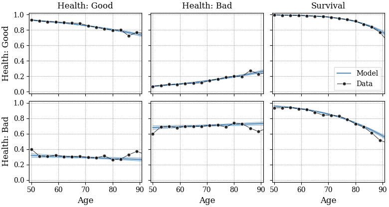
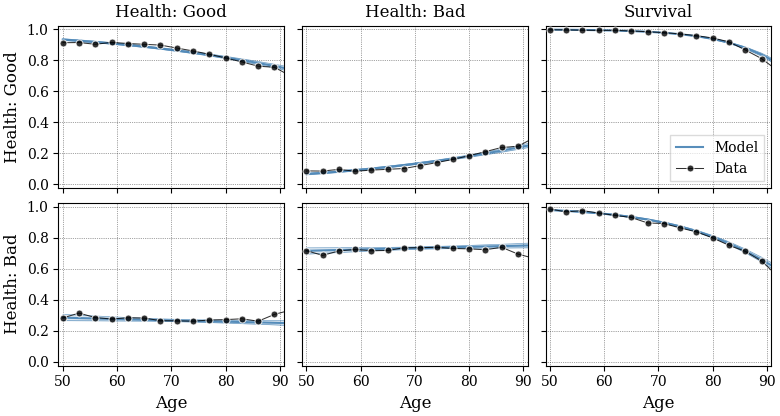
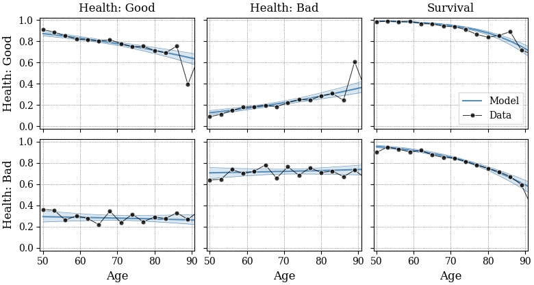
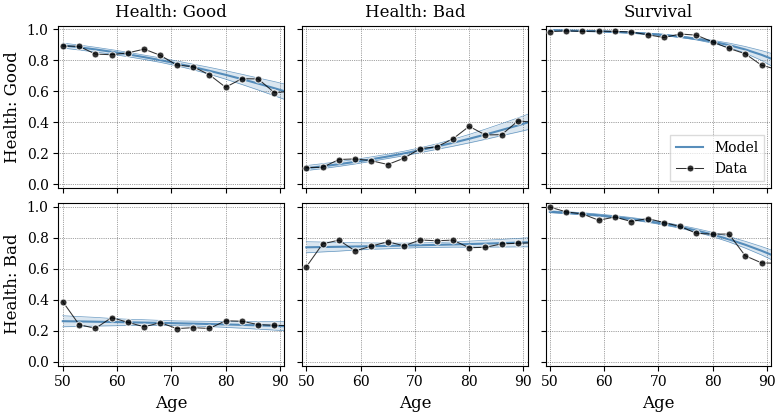
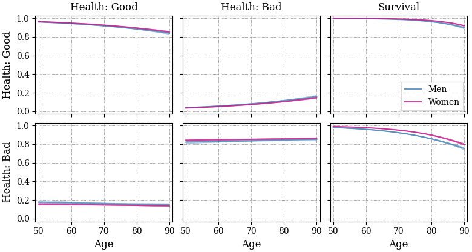
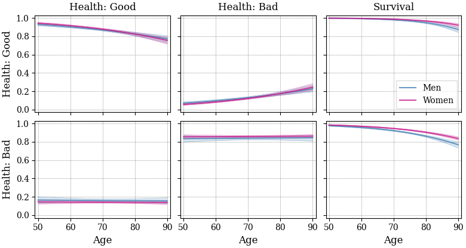

# Health and survival transition data for two health states

## Health and survival probabilities ## 

This directory contains estimates for a model with **two** health states which
are formed by combining the original five health states as follows:
-   Good: obtained by merging "excellent", "very good" and "good"
-   Bad: obtained by merging "fair" and "poor"

### Transition probabilities at two-year horizons ###

The next four graphs show the _two-year_ probabilities of transitioning
between the two health states _conditional_ on survival,
as well as the survival probability for each initial health state and age.
The model estimates _annual_ probabilities from biennial HRS data,
so when comparing the estimates to raw data, these need to be transformed
to two-year horizons.

The estimation is performed separately by
race and gender for the male/female and black/nonblack subpopulations.

Shaded areas represent bootstrapped 95% confidence intervals (not included
in the data files).

#### Male/nonblack ####

#### Female/nonblack ####

#### Male/black ####

#### Female/black ####

### Transition probabilities at one-year horizons ###

The next two graphs show the _annual_ transition probabilities which
correspond to the contents of the data files.

#### Male/nonblack and female/black ####

#### Male/black and female/nonblack ####

***

## Empirical health distribution ## 

To perform simulations using the above transition and survival probabilities,
an initial health distribution is required.

-   We provide the empirical distribution over health at age 50-51 and 
    age 70-71 observed in the HRS in the files `CSV/H2_health_dist.csv` 
    or `Excel/H2_health_dist.xlsx` for black/nonblack and male/female groups.
-   These population shares are computed from the estimation sample using
    the respondent-level weights.
