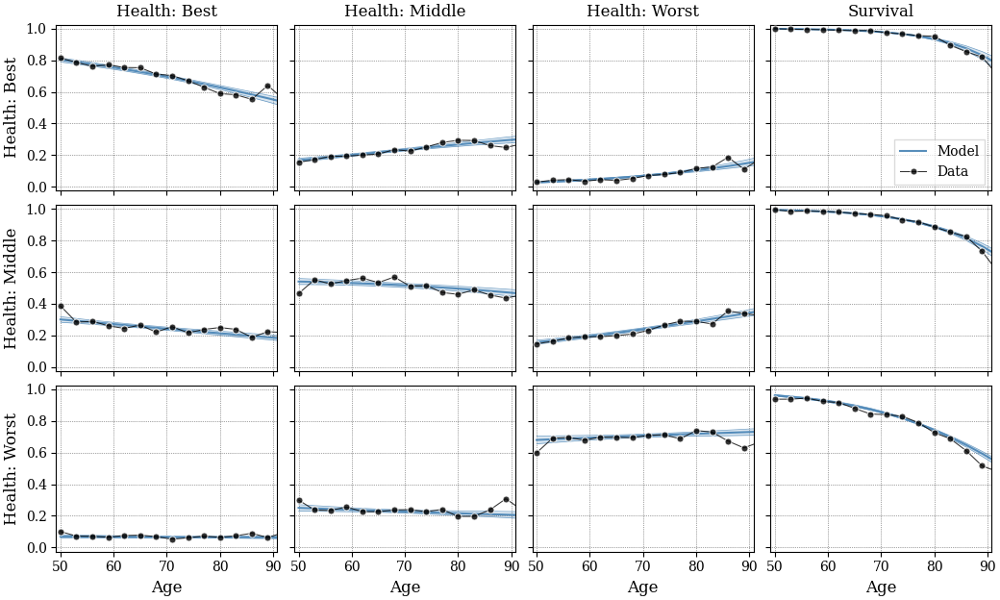
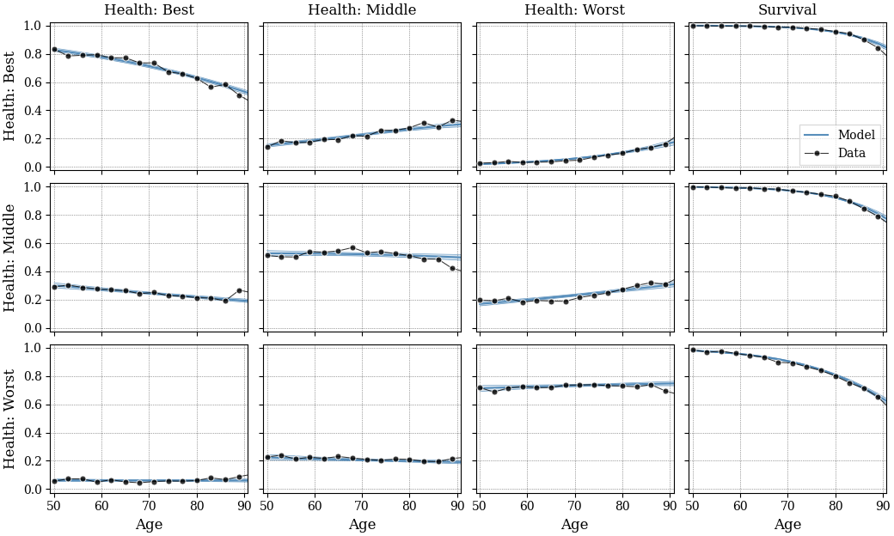
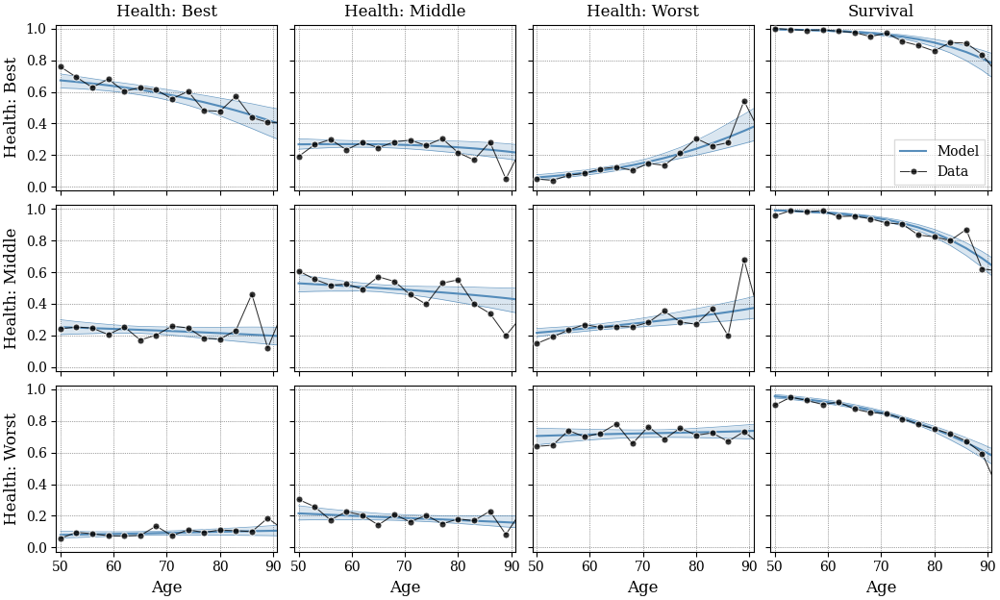
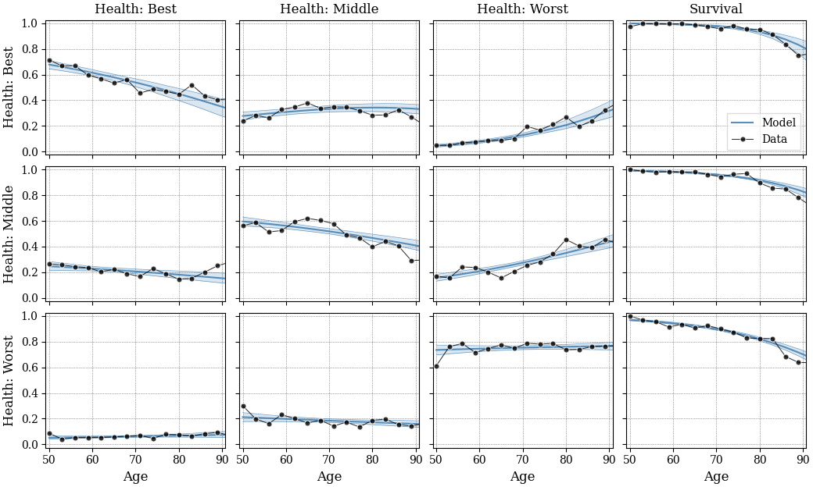
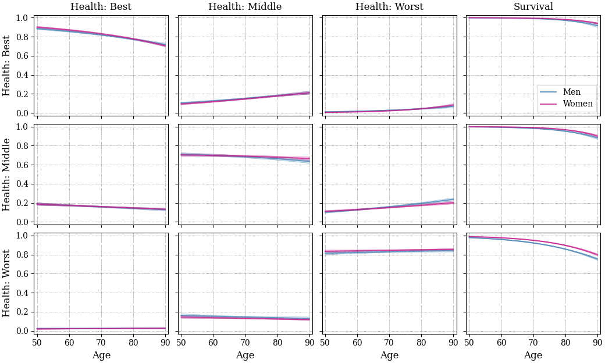
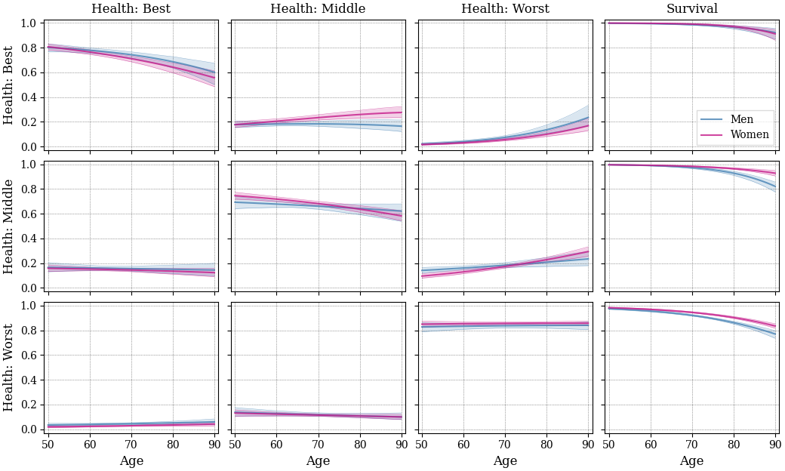

# Health and survival transition data for three health states

## Data files ## 

This directory contains estimates for a model with **three** health states which
are formed by combining the original five health states as follows:
-   Best: obtained by merging "excellent", "very good"
-   Middle: equivalent to the original "good" health
-   Worst: obtained by merging "fair" and "poor"

## Transition probabilities at two-year horizons ##

The next four graphs show the _two-year_ probabilities of transitioning
between the three health states _conditional_ on survival,
as well as the survival probability for each initial health state and age.
The model estimates _annual_ probabilities from biennial HRS data,
so when comparing the estimates to raw data, these need to be transformed
to two-year horizons.

The estimation is performed separately by
race and gender for the male/female and black/nonblack subpopulations.

Shaded areas represent bootstrapped 95% confidence intervals (not included
in the data files).

### Male/nonblack ###

### Female/nonblack ###

### Male/black ###

### Female/black ###

## Transition probabilities at one-year horizons ##

The next two graphs show the _annual_ transition probabilities which
correspond to the contents of the data files.

### Male/nonblack and female/nonblack ###

### Male/black and female/black ###

