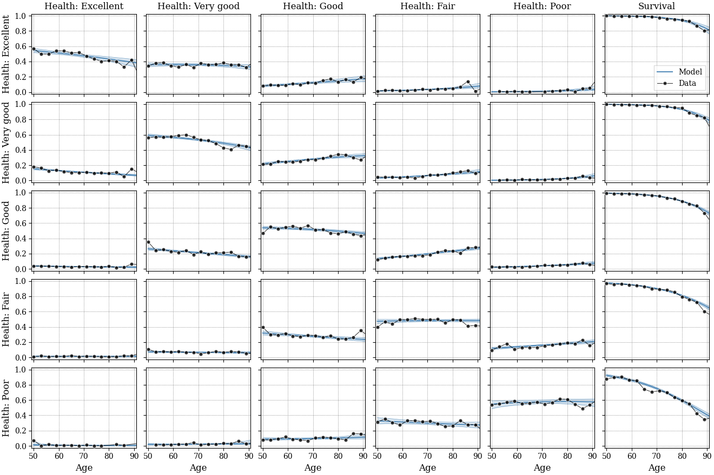

[](https://creativecommons.org/licenses/by/4.0/)

# Health and survival transition data

This is the companion website for the paper 
["Health Dynamics and Heterogeneous Life Expectancies"](https://www.foltyn.net/googlesites/health-process.pdf ) 
which hosts the health-to-health and survival transition probabilities
estimated from the [Health and Retirement Study (HRS)](https://hrs.isr.umich.edu/about)
for the United States
in CSV and Excel format.

Authors: Richard Foltyn, Jonna Olsson

## Citation and license ##

The contents of this repository is licensed under a
[Creative Commons Attribution 4.0 International License](https://creativecommons.org/licenses/by/4.0/).

If you are using the material in your research, please cite 

    Foltyn, Richard and Jonna Olsson: "Health Dynamics and Heterogeneous Life Expectancies", 2021

You can download the citation in [BibTeX format](health-process.bib).

## Data files ## 

1.  The root directory contains the estimates for the model with 
    all five health states reported in the HRS.
2.  The directory [Health-3](Health-3) contains the estimates for a model
    with a smaller set of only three health states, where we combine
    the first two ("excellent" and "very good") and the last two
    ("fair" and "poor") states.
3.  The directory [Health-2](Health-2) contains the estimates for a model
    where the first three health states are merged into one group and the 
    last two form the other group.

## How to use the data ##

The CSV files contain the health-to-health transition
and survival probabilities for individuals aged 50 to 99. 
The estimates for each demographic group are stored in a separate file.

The CSV files have the following format:
-   Each six lines correspond to an age-specific block, i.e. the first
    six lines are for age 50, the next six for age 51, etc.
-   Within each block, the first 5 lines correspond to the initial health
    state: (1) excellent, (2) very good, ..., (5) poor.
-   Each column corresponds to one outcome: the first 5 columns are 
    health states conditional on survival, and the last column is the
    probability of dying.
-   The sixth line is present for completeness so that each age-specific
    transition matrix is 6-by-6. It represents the absorbing state of death.

### Loading the data ###

#### Python ####

The easiest way to load the CSV files is to use the [pandas](https://pandas.pydata.org/)
library:
```python
import pandas as pd

# Create DataFrame from CSV data
df = pd.read_csv('H5_trans_prob_age50-99_male_nonblack.csv', 
                 sep=',', index_col=['age', 'health'])

# print first 5 rows of DataFrame
df
             Health1   Health2   Health3   Health4   Health5     Death
age health                                                            
50  1       0.719711  0.241408  0.030696  0.005563  0.001779  0.000843
    2       0.104665  0.733652  0.146883  0.013242  0.000620  0.000938
    3       0.013198  0.179782  0.698615  0.095984  0.009609  0.002812
    4       0.005196  0.022208  0.228613  0.649323  0.083095  0.011565
    5       0.008903  0.004221  0.022783  0.224090  0.697839  0.042164
```

Alternatively, plain numpy also works:
```python
import numpy as np

data = np.loadtxt('H5_trans_prob_age50-99_male_nonblack.csv', 
                  delimiter=',', skiprows=1)

# Transition probabilities
prob = np.ascontiguousarray(data[:, 2:])

# Age corresponding to each row in prob array
age = np.array(data[:, 0], dtype=int)

# Health state corresponding to each row in prob array
health = np.array(data[:, 1], dtype=int)
```    


## Transition probabilities at two-year horizons ##

The next four graphs show the _two-year_ probabilities of transitioning
between the five self-reported health states conditional on survival,
as well as the survival probability for each initial health state and age.
The model estimates _annual_ probabilities from biennial HRS data,
so when comparing the estimates to raw data, these need to be transformed
to two-year horizons.

The estimation is performed separately by
race and gender for the male/female and black/nonblack subpopulations.

Shaded areas represent bootstrapped 95% confidence intervals (not included
in the data files).

### Male/nonblack ###

### Female/nonblack ###

### Male/black ###

### Female/black ###


## Transition probabilities at one-year horizons ##

The next two graphs show the _annual_ transition probabilities which
correspond to the contents of the data files.

### Male/nonblack and female/nonblack ###

### Male/black and female/black ###

